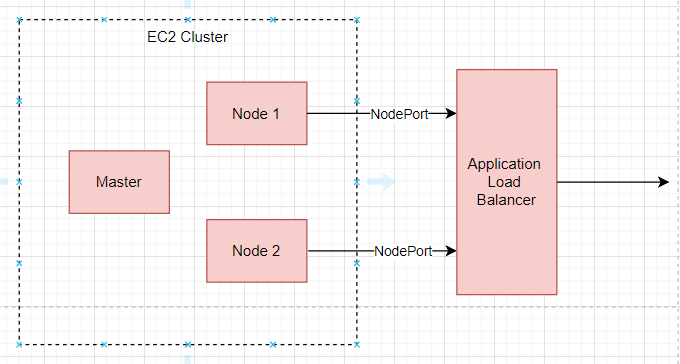

# Sensor Factory

## Description

This project it's focused on two things:
* provide fully-equipped platform which can be quickly delivered to external environments
* acquire, transform and analyze data from sensors 

Platform in this project collects data from sensors which are placed in the Haber process installation. Sensors are placed in locations where liquid flow is performed. 

The platform is composed in AWS CloudFormation specification. So, if you want to run this application you have to run CloudFormation specification and deploy all the modules. After usage, you can delete CloudFormation stack to save costs.

### Business logic

This platform collects data from sensors and passes it to streams so that the data is finally saved in the database. There is several types of sensors e.g. temperature, pressure or flow rate sensors. Sensors the same type are placed in different places in installation so to distinguish the location of the sensor, sensors have labels. For example temperature sensor may have `BeforeReactor` and `AfterReactor` labels.

On the platform there is user management system. Users may log in, create and get data reports from given sensor with given label. Data report consists of data, sensor type, time range, event key and sensor type. On the platform are built-in ADMIN users who can create other users. Users are equipped in roles. So there are several kind of users. For example there may be users who only may get reports or only may create reports.

### Cluster

This project consists of microservices which are placed on Kubernetes cluster. Kubernetes cluster is based on kubeadm, and it's embedded on AWS EC2 instances. Because of costs there is not EKS used. This is bare metal solution where MetalLB is used as load balancer and nginx is used as ingress controller. 

Access to public endpoints are performed by node ports and AWS Application Load Balancer.

But there is possibility to get access to cluster endpoints by ingress controller.

### Data flow

Data are simulated by generating them in AWS Lambda functions which are triggered by AWS step function. 

Generated data is published on the SNS topic and then data is delivered to Kubernetes cluster by SQS queue which is plugged in to SNS topic.

Further inside the Kubernetes cluster data is published on Kafka cluster and further it's transformed by Kafka Streams and then data is stored in PostgreSQL database.

Spring Boot Cloud allows us to collect data from SQS queue and pass it to internal cluster.

### CICD mechanism

All the modules have Kubernetes manifests which are used to deploy an application on the Kubernetes cluster. Manifests are stored in `kube` directory inside projects. 

Each module and library has its own AWS CodeBuild project. Each project has also `buildspec.yml` file which contains instructions how to build this project. Code build projects are used to perform module build or update files on Amazon S3 and transfer artifacts to AWS CodeArtifact. 

On Amazon S3 are stored lambda functions, deployment scripts, simulator configuration and AWS step functions. These files may be updated by executing AWS CodeBuild projects.

On the platform there is present event based CICD mechanism. Events are published on the CICD SNS topic and then those events may be handled by any CICD tool to perform an action.

All secrets are stored in AWS Parameter Store and are passed to sufficient config maps.

On the cluster is present `deployer` daemon process which handles deployments events from SNS topic, executes all the manifests for certain module and then performs deployment. If an application exists before event handling then application rollback is performed and further newer version is deployed.

### Projects that are part of the platform

* [entity-store](https://github.com/MySensorFactory/entity-store) - this project contains all JPA entities and it's repositories which are used in other modules
* [kafka-db-forwarder](https://github.com/MySensorFactory/kafka-db-forwarder) - this module forwards processed sensor data from Kafka cluster to database
* [sqs-kafka-forwarder](https://github.com/MySensorFactory/sqs-kafka-forwarder) - this module forwards raw sensor data from AWS SQS queues to Kafka cluster
* [data-service](https://github.com/MySensorFactory/data-service) - this module has API which allows users to create and pull processed data reports
* [front-service](https://github.com/MySensorFactory/front-service) - this module is secured API Gateway which exposes API for `users-service` and `data-service` outside the cluster
* [databse](https://github.com/MySensorFactory/database) - this module contains all the files which are required to create database on Kubernetes cluster
* [users-service](https://github.com/MySensorFactory/users-service) - this module has API which allows users management
* [api-store](https://github.com/MySensorFactory/api-store) - this module contains all API's written in OpenAPI specification which are used by other modules
* [FactoryInfrastructure](https://github.com/MySensorFactory/FactoryInfrastructure) - this project contains platform's files which are necessary to create platform stack on AWS
* [kafka](https://github.com/MySensorFactory/kafka) - this project requires all the files which are required to run Kafka cluster on Kubernetes cluster
* [kafka-data-processor](https://github.com/MySensorFactory/kafka-data-processor) - this module is responsible to process raw sensor data and publish processed data to Kafka cluster
* [factory-parent](https://github.com/MySensorFactory/factory-parent) - this project manages maven dependencies and their versions. This is maven parent for other modules 

### Required resources to create this platform CloudFormation stack

To be able to create platform stack you have to provide some external resources:

* AWS S3 bucket, where cicd files may be stored
* AWS CodeArtifact repository to provide place where artifacts may be stored
* Create sufficient parameters in AWS Parameter Store
* AWS EBS volume to provide place where database data may stored
* Dockerhub account to provide place where Docker images may be stored

### Technologies used

* Java 17
* Python
* Spring Boot
* Spring Cloud
* Spring Data JPA
* Spring Security
* Hibernate / JPA
* AWS
* Kafka
* PostgreSQL
* Docker
* Kubernetes
* OpenAPI

